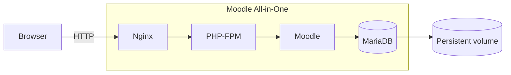

# Moodle All-in-One

An all-in-one Moodle container image based on the small Alpine 3.18 base image,
bundling Nginx, PHP-FPM, and MariaDB for quick local testing or demos. Moodle is
downloaded at build time and installed on the first container start.

> [!NOTE]
> Tested with Moodle 4.3 (stable403).

## Architecture



## Quick start

1) Copy the example environment file (optional but recommended)

```bash
cp .env.example .env
```

2) Build the image

```bash
docker build -t moodle_all_in_one:dev .
```

3) Run with Docker Compose

```bash
docker compose up -d
```

Moodle will take a moment to install on first run.
The first start can take a few minutes; watch the container logs to see
installation progress.

```bash
docker logs -f moodle-app
```

## Configuration

The Compose file reads variables from `.env`. If the file is not
present, built-in defaults are used.

Environment variables:

| Variable      | Default         | Description                                      |
| ------------- | --------------- | ------------------------------------------------ |
| `MOODLE_HOST` | `localhost`     | Hostname used in Moodle config and Nginx vhost.  |
| `MOODLE_PORT` | `9090`          | Port exposed by Nginx and used in Moodle config. |
| `TZ`          | `Europe/Berlin` | Container timezone.                              |
| `IMAGE_TAG`   | `dev`           | Image tag used by Docker Compose.                |

If you change `IMAGE_TAG`, build the image with the same tag.

Port changes must be reflected in both `MOODLE_PORT` and the port mapping.

## Default credentials (development only)

Moodle admin:
- Username: `admin`
- Password: `12345`

Database:
- Name: `moodle`
- User: `moodle_user`
- Password: `12345`

Change these values before using the image in any non-local environment.

## Persistent data

Volumes created in the image:
- `/var/lib/mysql` for the database
- `/var/www` for Moodle code and `moodledata`

If you want data to survive container rebuilds, bind or named volumes should
cover these paths.

The default `docker-compose.yaml` creates a named volume `moodle_db` for
`/var/lib/mysql`.

## Project layout

```
Dockerfile
docker-compose.yaml
config/
scripts/
```

## Scripts and config responsibilities

| Path                            | Responsibility                                                |
| ------------------------------- | ------------------------------------------------------------- |
| `Dockerfile`                    | Builds the image, installs services, and downloads Moodle.    |
| `docker-compose.yaml`           | Local orchestration with ports, volumes, and env vars.        |
| `build.sh`                      | Convenience build command for the image.                      |
| `scripts/init_script.sh`        | First-run setup, DB init, Moodle install, and config updates. |
| `scripts/simple_cron.sh`        | Runs the Moodle cron job once after startup.                  |
| `config/nginx.conf`             | Base Nginx configuration and hardening.                       |
| `config/conf.d/moodle.template` | Nginx vhost template populated from env vars.                 |
| `config/fpm-pool.conf`          | PHP-FPM pool and socket configuration.                        |
| `config/php.ini`                | PHP runtime settings.                                         |
| `config/mariadb-server.cnf`     | MariaDB server configuration.                                 |
| `config/supervisord.conf`       | Process supervision for Nginx, PHP-FPM, MariaDB, and cron.    |

## Updating the Moodle version

The download URL is defined in `Dockerfile`. Update the link to a
new `stable` release when you want a different Moodle version.
